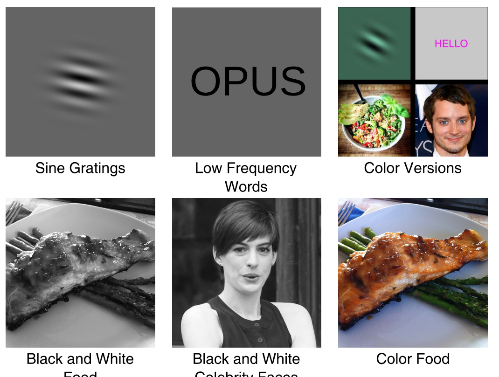
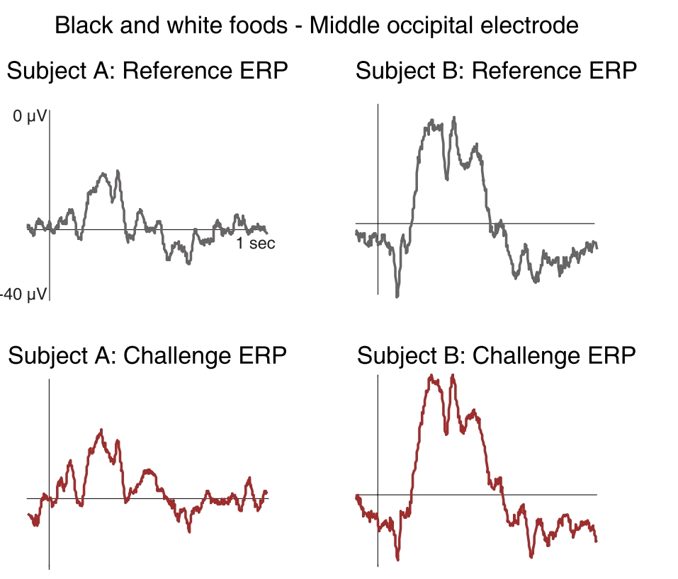
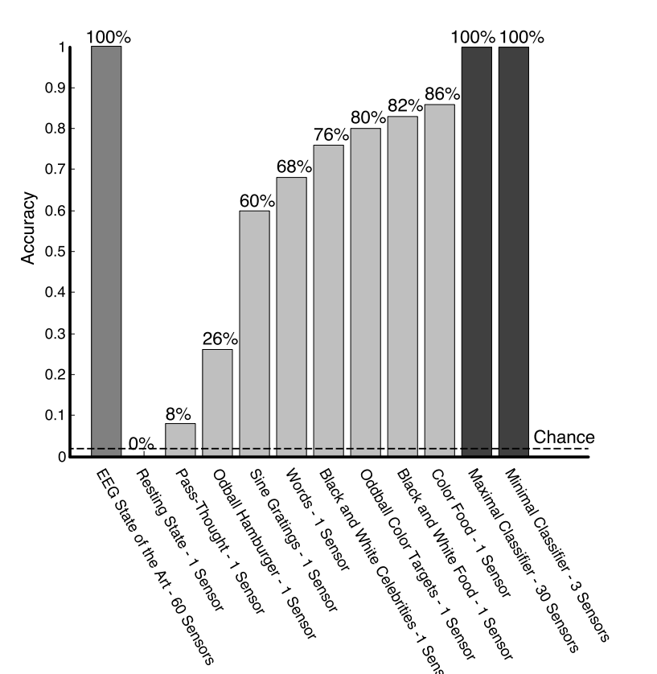

## Abstract
- 用erp诱发出不同人对刺激的不同反应

## INTRODUCTION

- 刺激是必要的
	>While this makes it convenient to collect, the fact that it
	is collected in the absence of stimulation means that the
	mental states of the user are under no experimental control
	during its collection. Thus, two users ostensibly undergoing
	the same biometric enrollment and challenge protocol might
	actually be in very different cognitive states, both from each
	other and across acquisition sessions, making the classifier’s
	task much more difficult. Additionally, because the EEG is
	often analyzed in the frequency domain for biometric use, it’s
	temporal resolution is extremely poor.

- 实验所用刺激
	

- time-locked?

- 假设
	>We hypothesized that, by controlling the cognitive state
of users through specific modes of stimulation likely to
produce differential responses across participants, especially
when multiple modes are combined, we would be able to
achieve higher biometric identification accuracy than has been
achieved in the past by protocols that do not control the
cognitive state of the user or that do not combine multiple
modes of stimulation.

## THE CEREBRE PROTOCOL

- 方法
	通过五类刺激来实现脑电的分类

- 五个刺激类别
	- Sine gratings
	- Low frequency words
	- Images of foods（图片选择问题）
	- Celebrity Faces（图片选择问题）
	- Oddball stimuli：（P300？）四分之一的图片是有颜色的，当有颜色的图片出现时，受试者被要求按下一个按钮
	- plus(pass-thought)

- 为什么这五个类别叠加起来很有效  
	拿两类举例，首先每个人喜欢的食物可能不一样，就算一样，这两个人的词汇量也不可能完全一样，这样五类下来，区分度就很大了。另一方面，正弦波会使视觉方面的大脑皮层比较活跃，而食物可能会使嗅觉方面的大脑皮层比较活跃

## METHODS

- Participants  
	50个受试者

- Materials
	>participants were exposed to 400 images,100 sine gratings, 100 low frequency words,100 images of foods, and 100 celebrity faces. 300 of the 400 were presented in black and white, and a different random 100 for each participant were selected, without	replacement, and presented in color

- Procedure  
	- pass-thought
	- eye movements and muscle tension
	- when the black key icon appeared, they were to think of their pass-thought
	- The 400 images were broken into 4 blocks of 100 images each, and participants were given breaks between blocks
	- The total duration of the experiment was approximately 1.5 hours, including 0.5 hour for electrode placement and variable time in the breaks between blocks. Each block lasted approximately 5 minutes and there were 6 blocks in total.

- EEG Recording
	- The EEG was recorded from 26 active Ag/AgCl ring electrodes placed in an elastic EasyCap with a geodesic arrangement.
	- EOG？

- Classification
	- cross-correlation
	- the cross-correlator was more accurate than any other single classifier, including SVM
	- reference ERP  challenge ERP
	- 
	- >each participant’s challenge ERP was cross-correlated with their own reference ERP (self-self) and with the reference ERP of the 49 other participants also in the system (self-other).
	- 不需要特征提取
	- 上面所做的分类是基于某个通道、某个刺激做的分类，并没有把所有类型的刺激结合起来一起使用

- RESULTS
	- 
	- 
	- 从上面的图可以看出来，单通道、一个刺激的准确率并不能达到100%，那么将所有通道所有刺激结合起来的效果可能很好
	-  including votes from all 30 channels and all 6 stimulus types (for a total of 180 votes per challenge ERP). This classifier achieved 100% identification accuracy
	- 通过这种方式，实现了100%的准确率，但是数据量又太大了，可以尝试通过叠加这几个单类分类器来实现
	- The “minimal” classifier that still allowed 100% identification accuracy included votes from 4 single-item type classifiers (Black and white celebrities, Oddball color targets,Color food and Words) over 3 electrodes, located over the left middle occipital (LMOc), right middle occipital (RMOc) and middle occipital (MiOc) channels.
	- 另一种减少时间的方法是reduce the number of trials included in the challenge
	- The minimum number of trials needed in the challenge to produce 100% identification accuracy was 27 trials (=27 seconds) for the maximal classifier. The minimal classifier did not reach 100% accuracy unless all available trials were used.
